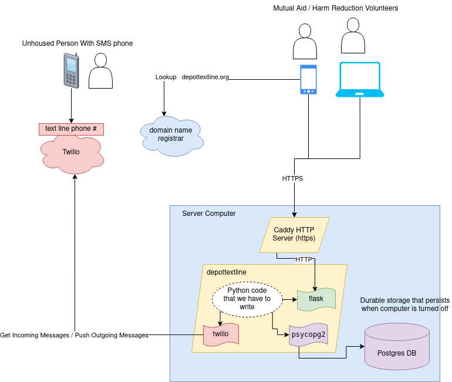
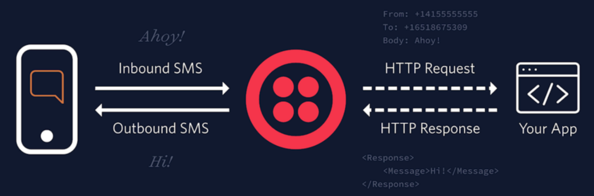
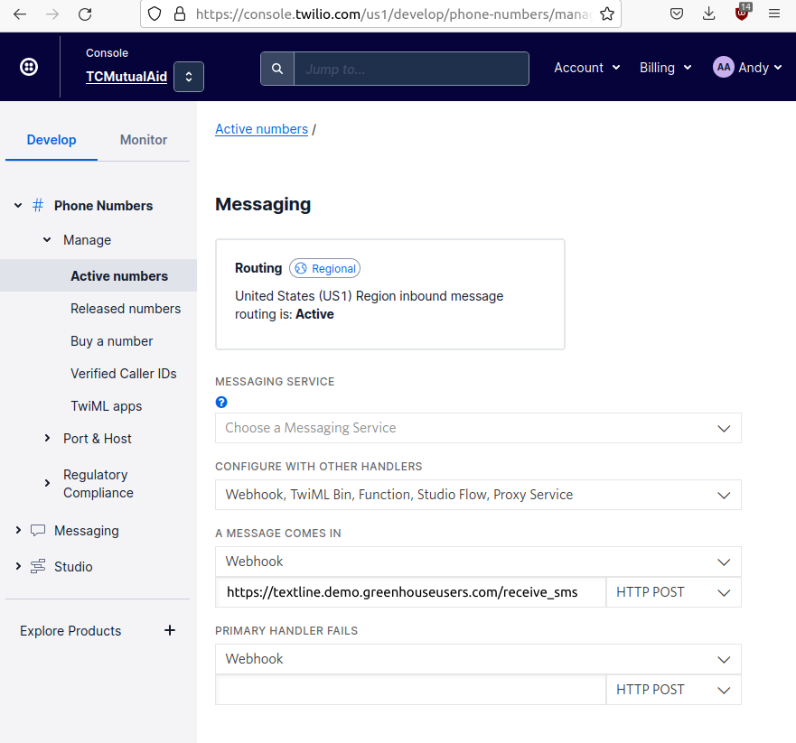

# depottextline
Text application for Supply Depot




This diagram was created with https://app.diagrams.net/.
To edit it, first download [readme/diagram.drawio.png](readme/diagram.drawio.png),  open the https://app.diagrams.net/ web application, and open the PNG file you downloaded.


# How to set up this application locally


## Python Packages

We're using a tool called [pipenv](https://pipenv.pypa.io/en/latest/index.html) to create/manage a python virtual environment for the app.

The virtual environment allows the python package dependencies to be installed in thier own little world separate from whatever packages might be installed globally on the developer's workstation. It prevents python package dependency version conflicts and helps the application setup stay repeatable in the future as python packages change.

First, make sure that you are using the [`pip`](https://packaging.python.org/en/latest/key_projects/#pip) that is associated with python 3, not python 3:

```
$ pip --version
pip 21.3.1 from /usr/local/lib/python3.6/site-packages/pip (python 3.6)
```

Note the python 3 at the end, not python 2.7.

If you see python2, use `pip3` instead.

Next, install `pipenv` with `pip install pipenv`

Finally, you should be able to install all of the package dependencies for the project (pulled from the `Pipfile`) with `pipenv install`

## Virtual Environment

Once the packages are installed, you are ready to enter the virtual environment and start working on the app!

The `pipenv shell` command will enter into a new shell session within the virtual environment.

Alternatively, you can run a single command within the virtual environment (without modifying your current shell session) with `pipenv run <your command here>`

## Application Configuration / Secrets

We are using the `.env` file to store our secrets and some application configuration values.
The [`python-dotenv`](https://github.com/theskumar/python-dotenv) package we installed will parse this file when the application starts and load the variables inside the file as system environment variables.  Then the python code can access them with [`os.environ.get(...)`](https://docs.python.org/3.8/library/os.html#os.environ).

## Twilio Webhooks Setup

Twilio offers a service where our application can be notified every time someone sends an SMS message to the text line. 

This receive-sms service [works via Webhook](https://www.twilio.com/docs/sms/tutorials/how-to-receive-and-reply-python).  That means that Twilio sends an HTTP request to our application.  Here's Twilio's own diagram of how this works: 



When we run the server application during development, it's not reachable over the network or the internet, we can only connect to it locally.  So of course, Twilio can't connect to our app from thier servers.

In order to solve this problem, we're currently using forest's [greenhouse](https://greenhouse-alpha.server.garden/) cloud service. 

  1. Sign up for a greenhouse account
  2. Install greenhouse on your computer
  3. Configure a greenhouse HTTPS tunnel to `http://localhost:5000`
  3. Log into the Twilio administration console and set the SMS messaging Webhook URL to whatever your greenhouse tunnel URL is, plus `/receive_sms` at the end, like so:



## Running the Application 
Here is what your `.env` file should look like:

```
ACCOUNT_SID="ACq398hgbuiblahblahblahblahblahblah"
AUTH_TOKEN="kii923ggbuiblahblahblahblahblahblah"
TEXTLINE_NUMBER="+17633632275"
```

## Database

`sudo apt install postgresql`

`sudo systemctl start postgresql.service`

`sudo systemctl status postgresql.service`

```
$ sudo -u postgres psql
psql (12.12 (Ubuntu 12.12-0ubuntu0.20.04.1))
Type "help" for help.

postgres=# create database "depottextline";
CREATE DATABASE
postgres=# create user "depottextline" WITH PASSWORD 'blah';
CREATE ROLE
postgres=# grant all privileges on database "depottextline" to "depottextline";
GRANT
postgres=# quit

```

## Running the Application

If you are already in the virtual environment:

`flask --app app run`

Otherwise:

`pipenv run flask --app app run`

Then you should be able to load it up in your web browser at `http://127.0.0.1:5000`
